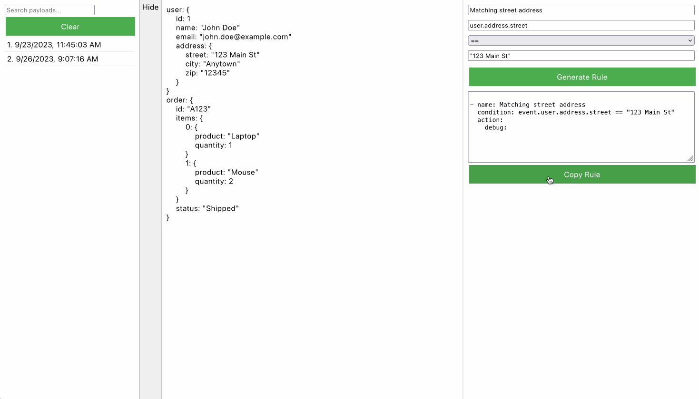

# EventScribe

EventScribe is a development tool designed for Event-Driven Ansible (EDA). The application provides a simple web interface that allows you to send JSON payloads via webhooks. These payloads are displayed in the UI, and users can inspect the JSON structure, search within payloads, and copy JSON keys using dot-notation for further use in rulebooks or other configurations.

When used in conjunction with the EDA event filter, [`cloin.eda.poster`](https://github.com/cloin/cloin.eda/blob/main/extensions/eda/plugins/event_filter/poster.py), you're able to capture the event structure before having written any rules thus helping to gain familiarity with the event structure and rapidly write conditions.



## Features

- **Payload Reception**: Receives JSON payloads via webhooks and displays them in the UI.
- **Live Updates**: The UI updates in real-time as new payloads are received.
- **JSON Viewer**: Provides a JSON viewer for inspecting payloads.
- **Search**: Allows for searching within the received payloads and within the selected JSON object.
- **Copy JSON Key**: Provides the ability to copy JSON keys in dot-notation format to the clipboard.

## Tech Stack

- **Frontend**: React
- **Backend**: Express.js

## Prerequisites

- Node.js
- npm or yarn
- Podman or Docker (optional for containerization)

## Installation and Running

### Running the Backend

```bash
cd server
npm install
npm start
```

### Running the Frontend

```bash
cd client
npm install
npm start
```

### Using Docker/Podman (Optional)

```bash
# In the root directory
podman-compose up -d